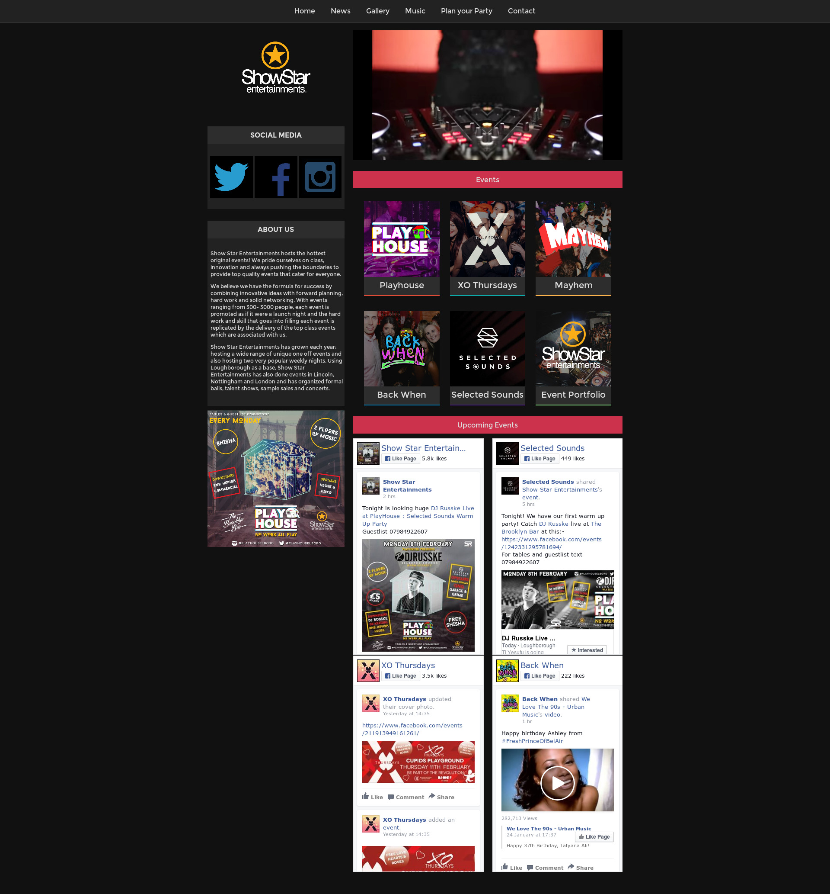
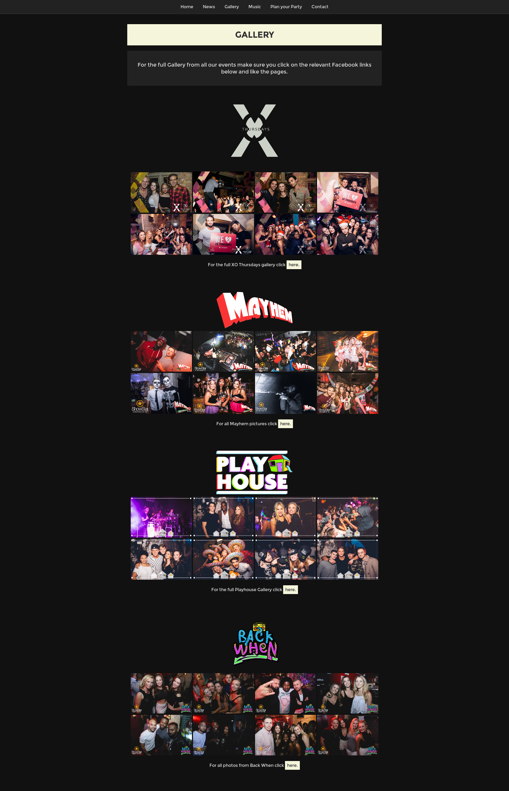

# ShowStar Entertainments

A website built for the company ShowStar Entertainments. The websites main function is to showcase various
clubs and events owned by ShowStar Entertainments as well as provide information
and news on upcoming events and/or changes. The website was built in close
contact with the client and has been built to very specific design requests.

## Technologies Used 

The website was built using Sinatra to allow for routing and templates, as
well as for use with the Mailgun Gem used in the contact forms. 

Facebook's SDK is also used for the widgets corresponding to each club/events
social media pages.

The website was designed by Nathaniel Green, using standard HTML & CSS, with
embedded ruby for the templating, and a CSS grid framework 'Gridism' by cobyism was 
also used in some areas. More information on Gridism can be found at this link http://cobyism.com/gridism/.

## Media 

All pictures, videos, icons and logos used on the site were either provided by ShowStar Entertainments or
created by Nathaniel Green.

## Screenshots

#### Homepage

#### Gallery 

